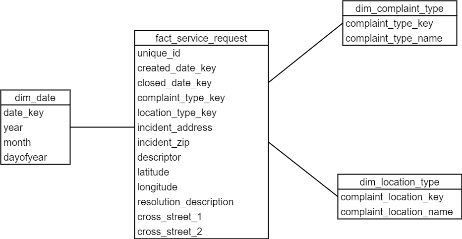

# NYC 311 Requests Analysis for the Kaporos Ritual

- [Introduction](#introduction)
- [Architecture](#architecture)
- [Data Model](#data-model)
- [Testing](#testing)
- [Outcome](#outcome)

## Introduction

[Kaporo](https://en.wikipedia.org/wiki/Kapparot) is a traditional practice by some orthodox Jewish people to use chickens as a symbol of atonement, or to transfer one's sins to. The chickens are slaughtered after the ritual in the streets. It is estimated that at least 60,000 chickens are slaughtered only in Brooklyn every year. This is not only a cruelty to animals, but also a potential cause of public health crisis as the dead birds, blood, body parts are all on the slaughter sites, on public streets. For more information about kaporos, please read this [post](https://www.adoptakaporossurvivor.com/whatiskaporos).

In this project, I digged into 311 service requests from [NYC Open Data](https://data.cityofnewyork.us/Social-Services/311-Service-Requests-from-2010-to-Present/erm2-nwe9) and tried to understand more about the kaporos-related complaints and discover the major sites where the ritual happens. To do that, I built a data pipeline in AWS ecosystem and put up a QuickSight dashboard to visualize the results.

If you would like to get the access to the dashboard, or if you have any questions or comments, please feel free to reach me at ayao780607@gmail.com!

Click [here](https://us-east-1.quicksight.aws.amazon.com/sn/accounts/607143918644/dashboards/ce780170-26a3-4382-8461-1db5d34ae445) to view the dashboard (permission required).

## Architecture

The major reason to choose Spark over MapReduce here is that Spark uses RAM to cache and process data whereas MapReduce processes data on disk. As a result, Spark is up to 100 times faster than MapReduce.

Amazon Redshift is utilized since it is optimized for analytics and large datasets, compared to OLTP systems. Although we do not have a very large dataset here (~500K requests) so it is a bit overkill, it is neverthless a good practice to use an OLAP system as the data warehouse.

## Data Model

Dimension Tables: `dim_complaint_type`, `dim_date`, `dim_location_type`
Fact Table: `fact_service_request`

I chose a star schema to model various aspects of the requests. The date dimension table has other attributes such as year/month/day of the year so it is easier for end users to query against those fields (such as count of animal torture cases in a particular month for each year).

## Testing

**End-to-end system testing** is in place to ensure the pipeline does not break when adding new features. This is done by mocking the sample data when reading from NYC Open Data API, running the pipeline, and verify in the data warehouse to see if the output is expected. The test can be carried out by running `pytest` manually.

I also wrote some **data quality testing** to make sure the transformed data meets the business constraints and rules, for example, if the request dates of all the requests meet our query to the data source.

## Outcome

Here are some screenshots of the dashboard:

From the above, there are at least five clusters with large number of complaints, which can be the sites where the ritual was carried out. The sites with the most complaints among all are 205 Wilson Street and 285 Lee Avenue, each with 31 complaints during the 2022 kaporos.

Also at the sites above, there are totally 396 possibly related complaints, including animal torture (194), unsanity animal private property (47), animal facility without permit (42), and many more.  

For those complaints above, only few compliant types have been updated with actions by the Police Department, while other complaint type like animal facility without permit, animal odor, animal waste, do not have any requests with actions by the Police Department.

## Meet the kaporos survivors!

Luckily, a tiny portion of the birds survived kaporos. Some of them managed to escape from the crates, and some are spared by kind members of Hasidic community. In Fall of 2021, I had the priviledge to meet Fanny, Elinor, Marianne, and Elizabeth when I was doing my intern at Woodstock Farm Sanctuary. I was told that they were spared by a rabbi. They are some of the most funny and curious non-human animals I have ever interacted with, with so much personality. They were about 8 weeks old and still peeping when they came to the sanctuary. Certianly, they did not know how closely they passed by the death but now they will only live a happy life they deserve.