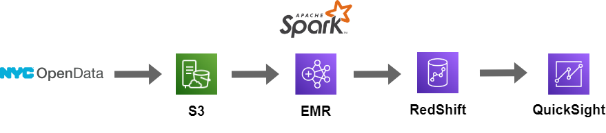

# NYC 311 Requests Analysis for the Jewish Kaporos Ritual

- [Introduction](#introduction)
- [Architecture](#architecture)
- [Data Model](#data-model)
- [Testing](#testing)
- [Dashboard](#dashboard)
- [Usage](#usage)

## Introduction

[Kaporo (ro Kapparot)](https://en.wikipedia.org/wiki/Kapparot) is a traditional practice by some orthodox Jewish people to use chickens as a symbol of atonement, or to transfer one's sins to. The chickens are slaughtered after the ritual in the streets. It is estimated that at least 60,000 chickens are slaughtered only in Brooklyn every year [[source](https://www.adoptakaporossurvivor.com/whatiskaporos)]. This is not only a cruelty to animals, but also a potential cause of public health crisis as the dead birds, blood, body parts are all on the slaughter sites, on public streets. For more information about kaporos, please read this [post](https://www.adoptakaporossurvivor.com/whatiskaporos).

In this project, I digged into 311 service requests from [NYC Open Data](https://data.cityofnewyork.us/Social-Services/311-Service-Requests-from-2010-to-Present/erm2-nwe9) and tried to understand more about the kaporos-related complaints and discover the major sites where the ritual happens. To do that, I built a data pipeline in AWS ecosystem and put up a QuickSight dashboard to visualize the results.

If you would like to get the access to the dashboard, or if you have any questions or comments, please feel free to reach me at ayao780607@gmail.com!

Dashboard link:
https://us-east-1.quicksight.aws.amazon.com/sn/accounts/607143918644/dashboards/ce780170-26a3-4382-8461-1db5d34ae445

## Architecture

## Data Model

## Testing

## Dashboard

## Usage

spark-submit \
  --jars /usr/share/aws/redshift/jdbc/RedshiftJDBC.jar,/usr/share/aws/redshift/spark-redshift/lib/spark-redshift.jar,/usr/share/aws/redshift/spark-redshift/lib/spark-avro.jar,/usr/share/aws/redshift/spark-redshift/lib/minimal-json.jar \
  src/main.py \
  1>output.log \
  2>spark.log

## Some Hope