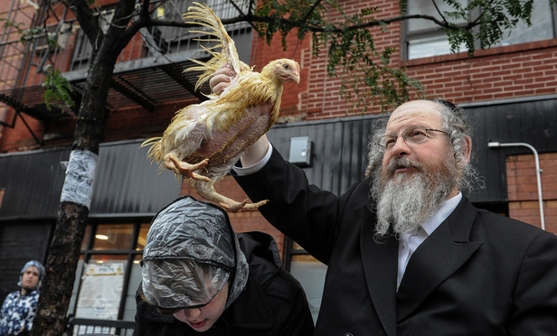
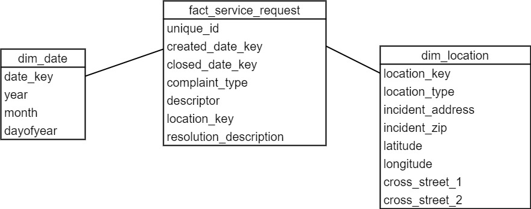
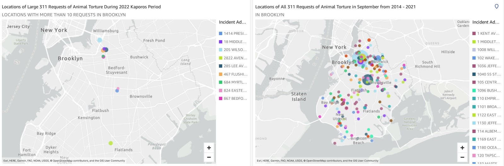
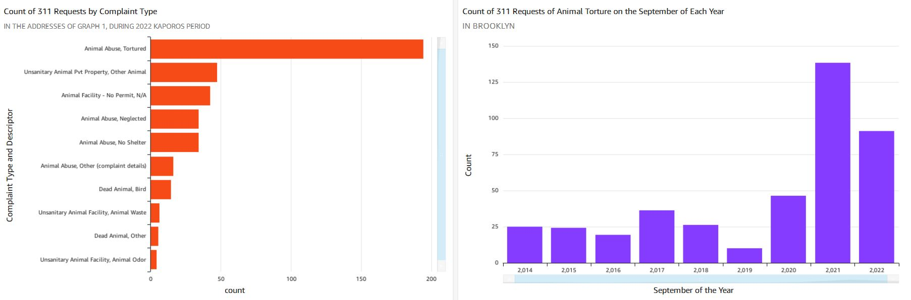
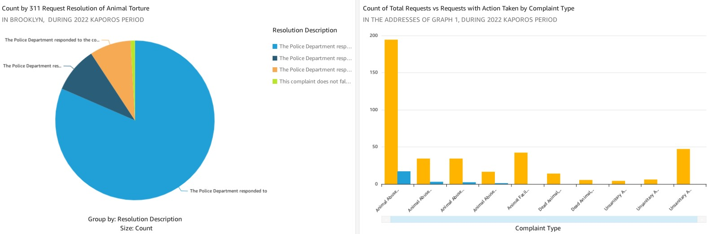
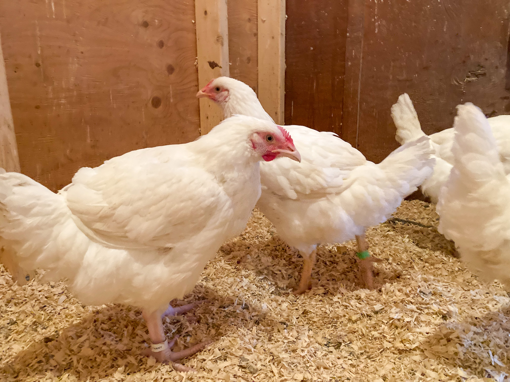

# NYC 311 Requests Analysis for Kaporos

- [Introduction](#introduction)
- [Architecture](#architecture)
- [Data Model](#data-model)
- [Testing](#testing)
- [Outcome](#outcome)
- [Meet the Kaporos Survivors!](#meet-the-kaporos-survivors)

## Introduction

[Kaporos](https://en.wikipedia.org/wiki/Kapparot) is a religious tradition practiced by some orthodox Jews in early fall focusing on cleansing one's sins. In some communities, people use chickens as atonement - they would swing chickens over the head and slauther them afterwards. In Brooklyn, chickens are left in plastic crates outside, denied food and water for up to a week before slaugher. It is estimated that at least 60,000 chickens are slaughtered only in Brooklyn every year. This is not only a cruelty to animals, but also a potential cause of public health crisis as the dead birds, blood, body parts are all over the public streets. For more information about using chickens as Kaporos, please read this [post](https://www.adoptakaporossurvivor.com/whatiskaporos).

*Reuters/Stephanie Keith*

In this project, I dug into 311 service requests from [NYC Open Data](https://data.cityofnewyork.us/Social-Services/311-Service-Requests-from-2010-to-Present/erm2-nwe9) and tried to understand more about the Kaporos-related complaints and discover the major sites where the ritual happens. To do that, I built a data pipeline in AWS ecosystem and put up a QuickSight dashboard to visualize the results.

If you would like to get the access to the dashboard, or if you have any questions or comments, please feel free to reach me at ayao780607@gmail.com!

Click [here](https://us-east-1.quicksight.aws.amazon.com/sn/accounts/607143918644/dashboards/ce780170-26a3-4382-8461-1db5d34ae445) to view the dashboard (permission required).

## Architecture

The major reason to favor __Spark__ over MapReduce here is that MapReduce writes the intermediate results into disk whereas Spark does that in memory. As a result, Spark is up to 100 times faster than MapReduce.

__Amazon Redshift__ is utilized since it is optimized for analytics and large datasets, compared to OLTP systems (though we process only about 500K requests here, not really a big dataset).

## Data Model

Dimension Tables: `dim_complaint_type`, `dim_date`, `dim_location_type`  
Fact Table: `fact_service_request`  

I chose star schema to model various aspects of the requests. The date dimension table has other attributes such as year/month/day of the year so it is easier for end users to query against those fields (such as count of animal torture cases in a particular month for each year).  

## Testing

**End-to-end system testing** is in place to ensure the pipeline does not break when adding new features. This is done by mocking the sample data when reading from NYC Open Data API, running the whole pipeline, and verify in the data warehouse to see if the output is expected. The test can be invoked by running `pytest` manually.  

I also wrote some **data quality tests** to make sure the transformed data meets the business constraints. For example, the test checks whether the request dates of all the requests meet our query to the data source. This is invoked everytime when the pipeline is run. If any of the tests fail, the pipeline will exit and nothing will be loaded into the data warehouse.

## Outcome

Here are some screenshots of the dashboard:

From the above, we can see that there are at least five clusters with large number of complaints, which could be the sites where the ritual was carried out. The sites with the most complaints among all are 205 Wilson Street and 285 Lee Avenue, each with 31 complaints during the 2022 Kaporos.

Also at the sites above, there are totally 396 possibly related complaints, including animal torture (194), unsanity animal private property (47), animal facility without permit (42), and many more.  

For those complaints above, only few compliant types have been updated with actions by the Police Department, while other complaint type, such as animal facility without permit, animal odor, animal waste, do not have any requests which was actioned by the Police Department on the ticket.  

## Meet the Kaporos Survivors!

Luckily, a tiny portion of the birds survived Kaporos every year. Some of them managed to escape from the crates, and some are spared by kind members of Hasidic community. They are often helped by animal rescue communities and volunteers to find their forever home. In fall of 2021, I had the priviledge to meet Fanny, Elinor, Marianne, and Elizabeth at Woodstock Farm Sanctuary, where I worked as an intern. They were some of the most funny and curious non-human animals I had ever interacted with, with so much personality. They were only about 8 weeks old and still peeping when they arrived. Certianly, they did not know how closely they passed by the death, but now they go on to lead wonderful and happy lives they so much deserve!  